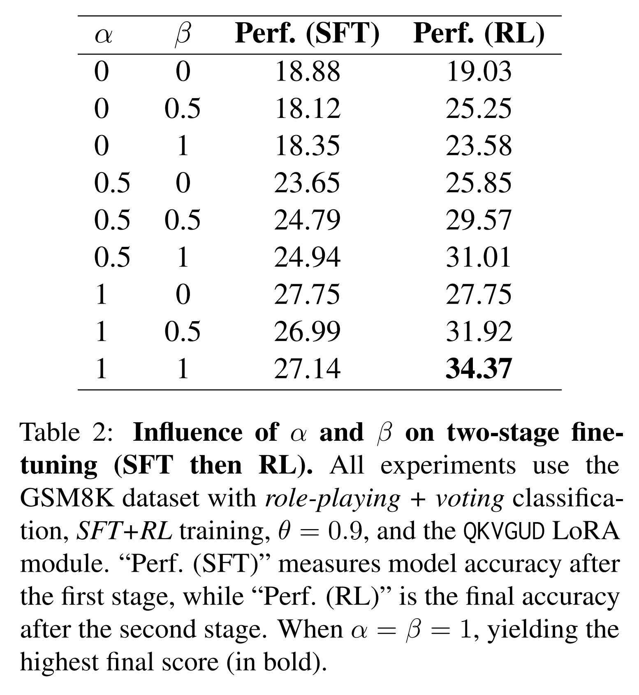
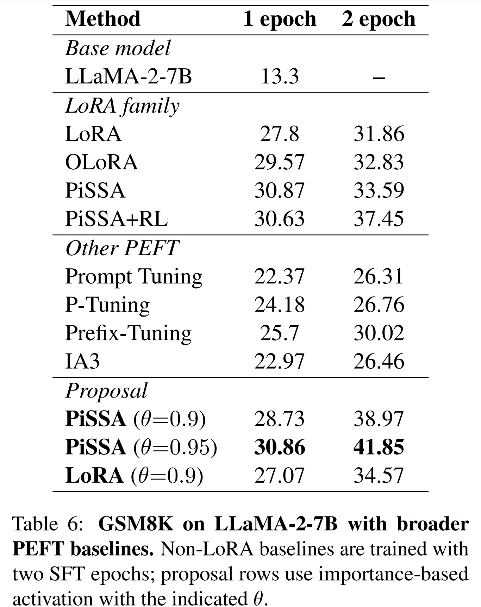

# LoRA-PAR: A Flexible Dual-System LoRA Partitioning Approach to Efficient LLM Fine-Tuning

<!-- Optional badges (add links) -->
<!--  -->
<!--  -->

**TL;DR.** We introduce **LoRA-PAR**, a dual-system PEFT framework inspired by *Thinking, Fast and Slow*. We (1) **split data** into System-1 (fast, intuitive) vs. System-2 (slow, multi-step) via **multi-model role-play + voting**, (2) compute **element-wise LoRA importance** to **partition a subregion** of parameters for each system (with a shared overlap), and (3) run **two-stage training**: **SFT** on System-1 then **RL (GRPO)** on System-2. With **~40% active LoRA parameters**, LoRA-PAR matches or surpasses strong PEFT baselines on GSM8K, MMLU, and HumanEval.

  

---

## Table of Contents
- [Highlights](#highlights)
- [Overview](#overview)
- [Data Preparation: System-1 / System-2 Labeling](#data-preparation-system1--system2-labeling)
- [Parameter Importance & Subregion Partitioning](#parameter-importance--subregion-partitioning)
- [Training Pipeline](#training-pipeline)
- [Results](#results)
- [Ablations](#ablations)
- [Additional Experiments](#additional-experiments)
- [Limitations](#limitations)
- [Reproducibility & Footprint](#reproducibility--footprint)
- [Citation](#citation)
- [License](#license)
- [Contact](#contact)

---

## Highlights
- **Dual-System PEFT**: Explicitly aligns **data** and **LoRA parameter subregions** with System-1 vs. System-2 demands.
- **Two-stage training**: **SFT → RL (GRPO)** to first consolidate fast, direct mappings, then reinforce multi-step reasoning.
- **Element-wise importance**: Importance via masked loss + 2nd-order proxy selects only the most impactful LoRA **elements**.
- **Efficient yet strong**: With ~**30–40%** active LoRA parameters (at \(\theta \approx 0.9\)), we match or outperform full baselines.

---

## Overview

**Intuition.** Different “subregions” of an LLM’s parameters are more helpful for **fast vs. slow** reasoning. We split both **data** (S1 vs. S2) and **parameters** (S1-only, S2-only, shared) and fine-tune them **selectively**.

**Pipeline.**
1. **Sample Splitter:** Multi-LLM **role-play + voting** labels each example as **System-1** or **System-2**.  
2. **Coordinator:** Compute **element-wise LoRA importance** per system; select top-importance **subregions** (plus shared overlap).  
3. **Two-stage Fine-Tuning:** **Stage-1 SFT** on S1 to strengthen intuition; **Stage-2 RL (GRPO)** on S2 to reinforce multi-step CoT.

  

> Caption: *Overview of LoRA-PAR: role-play voting → importance-based parameter partitioning → SFT→RL pipeline.*

---

## Data Preparation: System-1 / System-2 Labeling

We use **multi-model role-play + voting** to decide whether each instance is **S1** (fast, direct) or **S2** (multi-step reasoning). Teacher models “play” the target model and cast votes; the final label for each sample is aggregated by voting. 

  

*Role-play prompt and examples for System-1 vs. System-2.*

---

## Parameter Importance & Subregion Partitioning

We attach LoRA at **Q/K/V/Gate/Up/Down (QKVGUD)** by default (other patterns are supported). For each system (S1/S2), we compute **element-wise** importance with a **masked loss** that ignores prompt tokens (labels for prompt tokens = `-100`) so the signal focuses on answer generation.

**Second-order proxy (text form).**
- Let $\phi_j$ be a LoRA parameter element.
- $g_j = dL/\phi_j$ using the masked loss.
- $\hat{F}_{jj}$ is the diagonal Fisher approximation from per-example gradients.
- **Importance**: $I(\phi_j) ≈ | g_j * \phi_j - 0.5 * \hat{F}_{jj} * (\phi_j^2) |$

We **rank elements** by importance for S1 and S2 separately, then keep only the **top cumulative-importance** subset up to a threshold **theta** (e.g., $\theta = 0.90$). This yields three subregions:
- **S1-only**, **S2-only**, and **shared** (overlap).

  

Scatter of element-wise importance (S1 vs. S2) at $\theta = 0.9$. Red = S1-only, Blue = S2-only, Purple = shared.

---

## Training Pipeline

**Stage-1 (SFT on S1).**
- Activate all **S1-only** elements + an $\alpha$ fraction of **shared** elements.
- Train with standard SFT to consolidate fast, direct mappings.

**Stage-2 (RL on S2).**
- Initialize from the SFT checkpoint.
- Activate all **S2-only** elements + a **beta** fraction of **shared** elements.
- Train with **GRPO**; reward emphasizes **answer correctness** with additional lightweight formatting checks.

**Recommended defaults.**
- **LoRA**: rank `r=8`, `lora_alpha=64`, dropout `0.05` (SFT).
- **SFT**: max length 512, LR `2e-4`, cosine schedule, warm-up `0.03`, grad-accum 32, 1 epoch.
- **RL (GRPO)**: LR `5e-6`, weight decay `0.1`, warm-up `0.1`, group size 8, max prompt/resp 128/256, 1 epoch, grad-clip `0.1`.
- **Shared overlap**: `alpha = 1`, `beta = 1` performed best in our runs.

---

## Results

**Benchmarks.** GSM8K, MMLU (trained with Dolly15K or OpenPlatypus), HumanEval (code).  
**Backbone.** LLaMA-2-7B unless noted.  
**Baselines.** LoRA, OLoRA, PiSSA, PiSSA+RL.

  

*LoRA-PAR reaches up to **41.85%** on GSM8K with ~40% active LoRA parameters; competitive on MMLU & HumanEval.*

  

*Role-play + voting with more teachers (e.g., `n=5`) yields stronger downstream SFT.*

---

## Ablations

### Effect of $\theta$ (active-parameter fraction)

  

Performance increases with $\theta$, with diminishing returns near 0.8–0.9. Importance-based selection beats random subsets at the same sparsity.

  

At $\theta ≈ 0.9$, QKVGUD activates ~30–40% of elements while outperforming random selection.

### Shared-parameter activation via $\alpha$ and $\beta$

  

Setting $\alpha = \beta = 1$ (fully active shared region in both stages) yields the best final accuracy.

---

## Additional Experiments

### Generalization to Qwen-2.5-7B (GSM8K)

  

*LoRA-PAR improves from **68.69% (SFT)** to **81.65% (RL)** under the same recipe.*

### Broader PEFT baselines on LLaMA-2-7B

  

*Prompt-Tuning, P-Tuning, Prefix-Tuning, and IA3 underperform LoRA family here; PiSSA(θ=0.95) + our scheme reaches **41.85%**.*

### Order-of-training ablation (SFT → RL vs. RL → SFT)

  

*Starting with RL then SFT reduces final accuracy; SFT→RL continues to improve.*

---

## Limitations

- **Multi-model annotations** add compute and require access to strong teacher LLMs.  
- **Coarse S1/S2 partitioning** may miss finer-grained reasoning types.  
- **Backbone specificity**: We show LLaMA-2-7B and Qwen-2.5-7B; other families may need retuning of LoRA placement or ranks.

---

## Reproducibility & Footprint

- **Hardware**: single NVIDIA **L20 (48GB)**.  
- **Runtime** (GSM8K): SFT ≈ **<1h/epoch**; RL/GRPO ≈ **13h/epoch**.  
- **Efficiency**: Freezing low-importance LoRA elements reduces optimizer/memory footprint; inference similar to standard LoRA.

---

